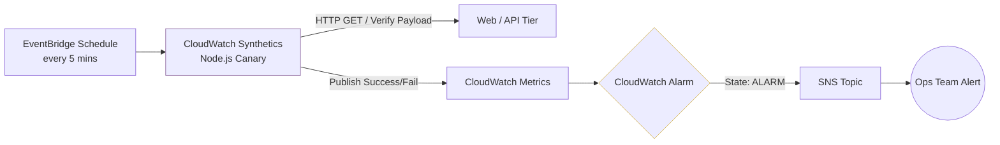

# CQ-0003: Implementing User-Centric Observability via CloudWatch Synthetics

* Status: accepted
* Deciders: Dean Kellham, [Redacted]...
* Date: 2025-10-30

Technical Story: Traditional infrastructure monitoring (CPU, Memory, Disk I/O) on [Company Q]'s compute tier was showing green, healthy metrics. However, edge-case application deadlocks meant the API and Web tiers were occasionally returning errors or timing out, leaving us blind to actual end-user experience degradation until customers complained.

## Context and Problem Statement

We need to monitor the availability and latency of the application from the "outside-in". The solution must verify that the Web UI and API endpoints are not just reachable, but are returning valid HTTP payloads and rendering correctly for the end user, ensuring true Business SLAs are met.

## Decision Drivers

* Proactive Alerting - the infrastructure team must know about application failures before the customer does.
* Accuracy - reducing false positives generated by raw infrastructure metrics and focusing on true user journey success.
* Integration - alerts must feed seamlessly into our existing incident management and CloudWatch dashboards.

## Considered Options

* Third-party tools (e.g., Datadog, Pingdom). Rejected due to high licensing costs, contract negotiations, and overhead of integrating external alerts back into our AWS-centric workflow.
* Custom EC2 cron jobs running curl/ping scripts. Rejected due to high maintenance overhead, lack of native dashboarding, and the "who watches the watcher" problem.
* AWS CloudWatch Synthetics (Canaries).

## Decision Outcome

Chosen option: "AWS CloudWatch Synthetics (Canaries)". We deployed lightweight, Node.js-based headless browser scripts via CloudWatch Synthetics. These canaries run on a scheduled interval (every 5 minutes), programmatically navigating the Web UI and querying the API.

### Architecture Diagram

### Positive Consequences
* Observability: We now have accurate, end-to-end latency and availability metrics based on actual user journeys.
* Native Integration: Canary failures instantly trigger CloudWatch Alarms, which integrate natively with our existing SNS alerting pipelines.
* Evidence: Synthetics automatically capture screenshots and HAR (HTTP Archive) files upon failure, drastically accelerating root-cause analysis for developers.

### Negative Consequences
* Introduces a negligible AWS cost for each canary run.
* Requires basic Node.js/Python knowledge to maintain or update the canary scripts if the application's DOM structure or API authentication heavily changes.