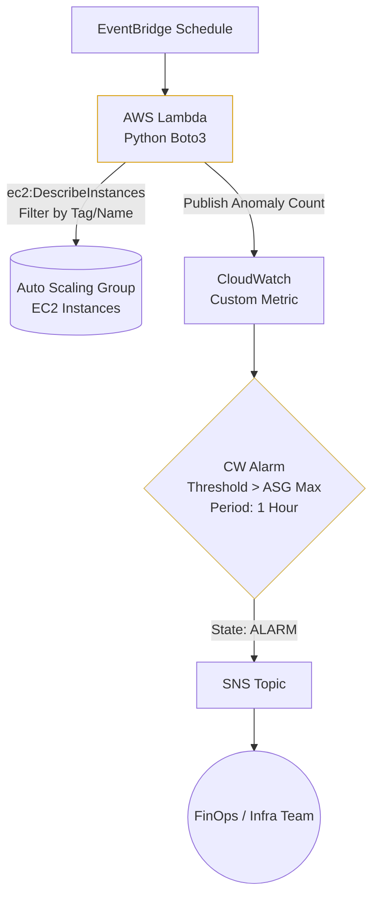

# CQ-0004: Automated FinOps Governance for Orphaned Compute Detection

* Status: accepted
* Deciders: Dean Kellham, [Redacted]...
* Date: 2025-12-05

Technical Story: Intermittent failures in [Company Q]'s CI/CD deployment pipelines were occasionally failing to cleanly terminate legacy EC2 instances during Auto Scaling Group (ASG) scale-in events. These "orphaned" instances were accumulating over time, leading to a silent but significant increase in monthly AWS compute spend.

## Context and Problem Statement

We need an automated governance mechanism to continuously audit the environment for rogue or orphaned EC2 instances. The solution must proactively identify compute resources that violate expected capacity limits, alerting the infrastructure team before the end-of-month billing cycle, without triggering false positives during normal deployment windows.

## Decision Drivers

* FinOps / Cost Optimization - stopping the financial bleed of unused, forgotten compute resources.
* Alert Relevance (Reducing Alert Fatigue) - the solution must differentiate between a legitimate CI/CD deployment spike and a genuinely orphaned instance.
* Low Overhead - the monitoring solution itself must not introduce high operational costs.

## Considered Options

* Manual billing and console audits. Rejected as it is reactive, time-consuming, and prone to human error.
* AWS Config Rules. Considered, but rejected for this specific use case as continuous evaluation of custom rules across a highly volatile compute environment can incur unnecessary AWS Config costs.
* Amazon EventBridge triggering a Custom AWS Lambda function with time-buffered CloudWatch Alarms.

## Decision Outcome

Chosen option: "Amazon EventBridge + Custom Python Lambda + CloudWatch Alarms"

We deployed a custom Python (Boto3) Lambda function, triggered via a scheduled Amazon EventBridge rule. The script calls the AWS EC2 API to count all instances matching the application's specific naming convention and publishes this aggregate count as a custom CloudWatch Metric.

Crucially, we configured a CloudWatch Alarm against this metric with a threshold set to the ASG's standard desired capacity, evaluated over a 1-hour time period.

### Architecture Diagram

### Positive Consequences
* Operational Maturity (Zero Alert Fatigue): By evaluating the metric over a 1-hour period, we successfully prevent false-positive alarms during legitimate CI/CD code deployments (where instance counts temporarily spike as new instances are brought into service for ~15 minutes).
* FinOps Efficiency: Instantly detects orphaned resources within hours of a failed CI/CD pipeline, saving thousands in potential wasted compute spend.
* Cost-Effective Tooling: The Lambda function takes milliseconds to run, meaning the cost of this automated governance is virtually $0.00 per month.

### Negative Consequences
* Requires maintaining a custom Python script.
* If the baseline desired capacity of the ASG needs to be permanently scaled up due to sustained traffic growth, the CloudWatch Alarm threshold must be manually updated to reflect the new baseline.