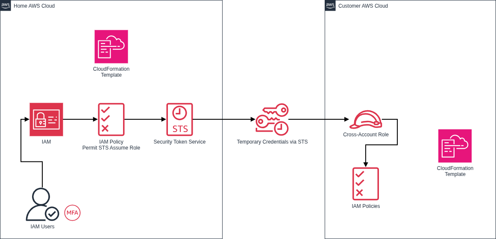

# IN-0002: Employing Cross-Account IAM Roles for User Console Access

* Status: accepted
* Deciders: Dean Kellham, [Redacted]...
* Date: 2025-12-10

Technical Story: We provide infrastructure support for a number of customers' AWS environments. All [MSP] technicians are currently using separate per-account IAM Users. This creates complexity that only increases as the number of customer AWS Accounts grows.

## Context and Problem Statement

We need a way to consolidate authorisation down to a single secure account, with manageable MFA, that can scale with more AWS Accounts involved. Any solution should operate under the principle of least privilege to reduce attack surface and blast radius.

## Decision Drivers

* Complexity & Manageability - too many IAM User accounts for technicians increases complexity, increases time wasted on password resets and MFA handling, and is more likely to encourage bad password hygiene.
* Scalability - as more AWS Accounts are needed to be managed, the effort involved continues to grow, adding admin time.
* Auditing - any solution should be able to quickly restrict access and onboard new technicians with minimal admin time.
* Security - all accounts should only have the access required to do the task at hand, limiting the attack surface and blast radius. 

## Considered Options

* Retain account-specific IAM User accounts. Continues to present high admin labour.
* Employ AWS IAM Identity Center and AD Connector to use our on-premises Active Directory Domain identities. This would need to be deployed in each managed AWS Account. Rejected because customer accounts reside in their own AWS Organizations, making a centralized cross-organization Identity Center complex compared to a Hub-and-Spoke STS model.
* Employ Cross-account IAM Roles in managed AWS Accounts that can be assumed by IAM Users within [MSP]'s AWS Account. Use CloudFormation templates to standardise deployment of these IAM Roles. Use IAM Policies within [MSP]'s AWS Account to control access to customer AWS Accounts.

## Decision Outcome

Chosen Option: Cross-account IAM Roles. This creates a need for managing only 1 set of IAM Users (within [MSP]'s own AWS Account). Access to the relevant IAM Policies can be easily controlled via IAM User Groups that align with technician role and responsibility. Deploying relevant IAM Policies and IAM User Groups for each new customer AWS Account can be deployed within [MSP]'s AWS Account using a CloudFormation template. Deploying the relevant IAM Roles in customer AWS Accounts can also leverage CloudFormation templates for consistency and accuracy.

### Positive Consequences

* Complexity & Manageability: a single set of IAM User accounts ensures quick account restriction, and single set of credentials and MFA tokens for each technician, encouraging better password / security hygiene.
* Admin: less time required for general administrative tasks surrounding user account setup, password resets, and access control.
* Security: all IAM Users will have minimal permissions unless and until temporary credentials are generated via AWS STS (sts:AssumeRole). This reduces attack surface and blast radius.
* Security: significant reduction in attack surface within customers' AWS Accounts, as no [MSP] IAM Users exist within them.
* Automation: CloudFormation templates ensure quick, consistent, and accurate deployment of required IAM Roles, IAM Policies, and IAM User Groups.
* Scalability: solution scales easily with minimal setup and no additional maintenance costs.

### Negative Consequences

* Initial customer will need to run provided CloudFormation template once.

### Links

